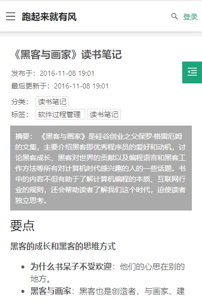

# lemon-blog
## 简介
一个简单的博客系统，技术栈为 Vue + Spring 。项目比较粗糙，可能存在较多问题，不推荐直接使用。代码比较简单，适合学习参考使用。

## 项目由来
在辗转了 Jekyll 、Hexo 以及一些开源博客系统后，决定自己写一个博客，主要原因如下：
- Jekyll、Hexo 等静态博客： 
1. 一般托管在 GitHub ，需要配合 Travis CI 触发更新，个人觉得不是很方便
2. 花了比较多的时间挑选自己喜欢的模板，进一步会去尝试自己定制样式，时间花在这个上不如自己写一个方便些...
3. 评论系统换了一个又一个（大家都懂的原因？），搜索、统计什么的都需要集成其它的系统，一个个配置过去...
4. 没有后端系统，想要增加一些与后端交互的功能很不方便

- 一些开源的博客系统
1. 只是想要一个简单的博客，放在我可怜的 1 核 2G 服务器上，Redis 、ElasticSearch 甚至 Spring Cloud 等微服务或者分布式技术觉得没必要...
2. 代码实现看着好难受，二次开发不舒服，杂七杂八的功能我也不需要

## 项目构成
项目分为三个部分：
- lemon-blog-frontend：博客展示前端，使用 Nuxt 做服务端渲染，做了一些移动端适配，主要技术：Vue、Vuex、Ant Design Vue、Nuxt
- lemon-blog-admin-frontend：博客管理前端，主要技术：Vue、Vuex、Vue Router、Ant Design Vue Pro
- lemon-blog-backend: 博客后端，主要技术：Spring Boot、Spring MVC、Spring Security、Mybatis Plus

## 项目预览
在线演示：https://suziquan.cn




## 安装使用

### lemon-blog-backend
1. 环境要求：已安装 jre 、maven ，需要 MySQL 数据库
2. 创建 MySQL 数据库，导入 lemon-blog-backend/src/main/resources/jdbc/schema.sql
3. 修改配置文件 lemon-blog-backend/src/main/resources/application.properties
    ``` yaml
    # 修改 MySQL 配置
    spring.datasource.url=jdbc:mysql://localhost:3306/lemon_blog?useUnicode=true&characterEncoding=UTF8&useSSL=false
    spring.datasource.username=mysql-username
    spring.datasource.password=mysql-password

    # 如果需要 github 登录，修改 github 认证配置
    social-auth.github.client-id=github-client-id
    social-auth.github.client-secret=github-client-callback
    social-auth.github.redirect-uri=github-redirect-uri

    # 修改 jwt secret key，可用 https://www.grc.com/passwords.htm 生成
    jwt.secret-key=jwt-secret-key
    ```

4. 执行 `mvn spring-boot:run` 启动服务，默认访问地址为 localhost:8080

### lemon-blog-frontend
1. 环境要求：已安装 nodejs 、yarn
2. 执行 `yarn install` 安装依赖
3. 后端接口地址在 nuxt.config.js 中配置
    ``` js
    proxy: {
      '/api': {
        target: 'http://localhost:8080',
        changeOrigin: true,
      },
    },
    ```
4. 开发环境：执行 `yarn dev`   
生产环境：执行 `yarn build` 和 `yarn start`   
默认访问地址为 localhost:3000

### lemon-blog-admin-frontend
1. 环境要求：已安装 nodejs 、yarn
2. 执行 `yarn install` 安装依赖
3. 后端接口地址在 vue.config.js 中配置
    ``` js
    devServer: {
      port: 8000,
      proxy: {
        '/api': {
          target: 'http://localhost:8080',
          ws: false,
          changeOrigin: true
        }
      }
    },
    ```
4. 开发环境：执行 `yarn serve` ，默认访问地址为 localhost:8000
5. 生产环境：执行 `yarn build` ，将 dist 目录下生成的文件静态部署即可。nginx 配置可参考：
    ```
    server {
        server_name 域名;
  
        listen       443 ssl http2;
        listen       [::]:443 ssl http2;
  
        # 执行 yarn build 后，dist 目录地址
        root /lemon-blog/lemon-blog-admin-frontend/dist;
  
        location / {
            try_files $uri $uri/ /index.html;
            proxy_set_header X-Real-IP $remote_addr;
            proxy_set_header X-Forwarded-For $proxy_add_x_forwarded_for;
            proxy_set_header Host $http_host;
       }
    }
    ```
